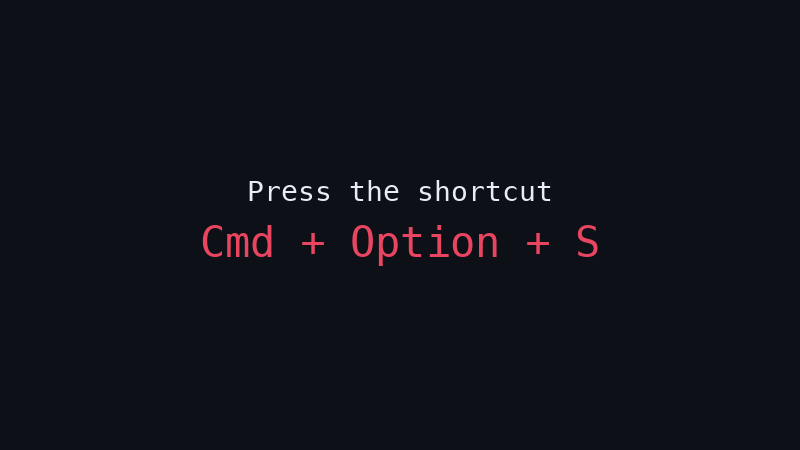

# snapstash

**One shortcut. Screenshot → clipboard + folder. Done.**

---

You take a screenshot. You want to paste it somewhere. You also want it saved.

macOS makes you choose. Clipboard *or* file. Not both.

**snapstash** does both. Every time. No app. No dependencies. Just two shortcuts.

---

## What it does

| Shortcut | What happens |
|----------|-------------|
| `⌃⇧S` | Full screen → clipboard + `~/Desktop/screenshots/` |
| `⌃⇧A` | Select area → clipboard + `~/Desktop/screenshots/` |

That's it. Press the shortcut, paste anywhere with `⌘V`, and the file is already saved.



---

## Install

```bash
curl -sL https://raw.githubusercontent.com/ai-wonderlab/snapstash/main/install.sh | bash
```

First run: macOS will ask for Screen Recording permission. Allow it once.

## Uninstall

```bash
curl -sL https://raw.githubusercontent.com/ai-wonderlab/snapstash/main/uninstall.sh | bash
```

Your screenshots folder stays. Your files are yours.

---

## How it works

Two macOS Automator Quick Actions. Each runs a three-line shell script:

1. `screencapture` saves to `~/Desktop/screenshots/`
2. `osascript` copies the saved image to clipboard
3. That's it. There is no step 3.

No background processes. No menu bar icon. No electron app wrapping a browser wrapping a screenshot.

Pure macOS. Native. Silent.

---

## Who this is for

You build things. You share what you build. You screenshot your terminal, your UI, your bugs, your wins.

You do this twenty times a day.

This saves you twenty decisions a day.

---

## Requirements

- macOS (tested on Sequoia 15+ and Tahoe 26+)
- That's the whole list

---

## License

MIT — do whatever you want with it.

---

*Snap it. Stash it. Paste it.*
